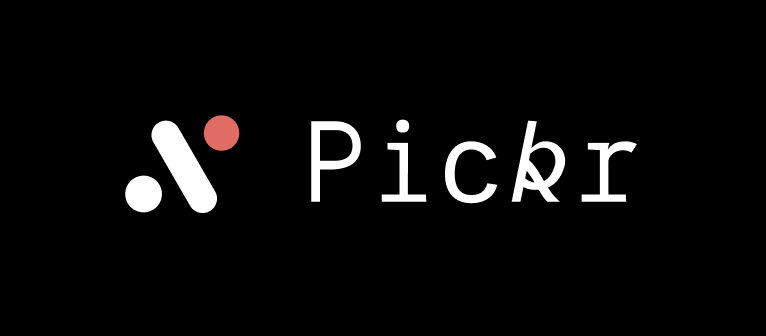

<h1 align="center">
  
</h1>

<h3 align="center">
  CDUT Sino-British Project Management System
   
  Designed by Chengxin Zhao 2023 - OBU Granduate Project
</h3>

  
  
  
  
  
  

## Features
- Students need to be able to view information of their supervisors and the topic, select topic within a specified period, and view the progress of their project selection or customize their own topic. 
- Supervisors can add their own topic and description information, set quotas for their projects, view students who have selected them, and export their selection results as a table. 
- Managers can add students, add teachers, and quotas. 
- The project needs to set up an algorithm for students’ selections of topics and supervisors: each student can choose three topics and ranks by the order of priority. If their first choice is approved, the following two choices will be nullified, and so on. The submissions of students will be considered by the order of submission time, namely, selections submitted earlier will be considered before those submitted latter. If none of the three choices are available, the student needs to resubmit in the second phase. Project managers can also modify the topic and supervisor choose of students. 

